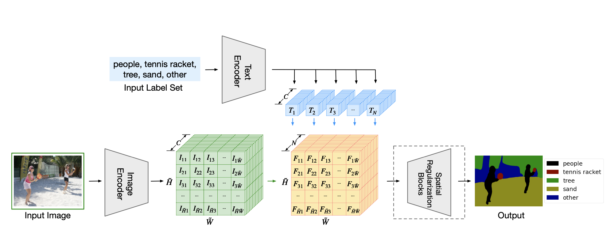
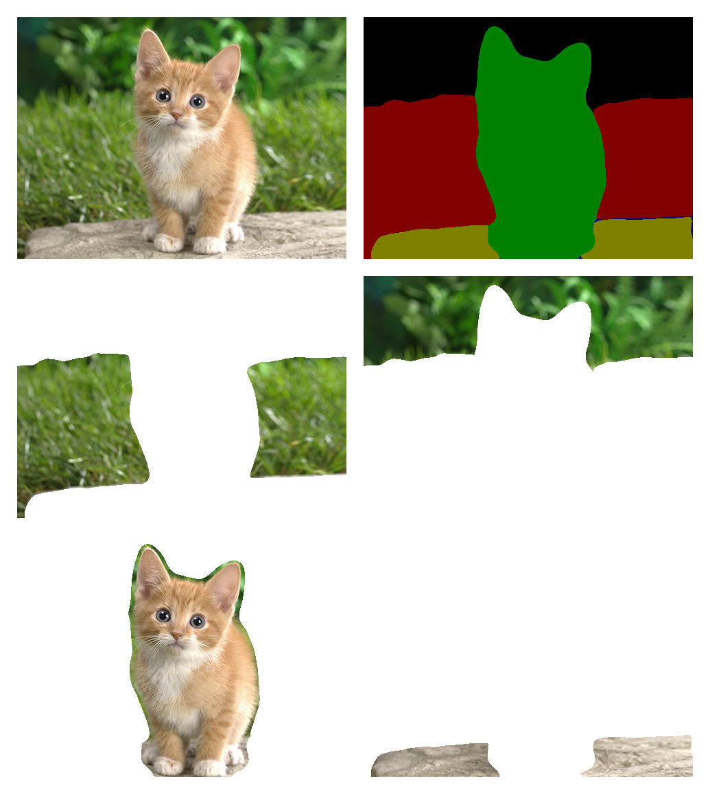
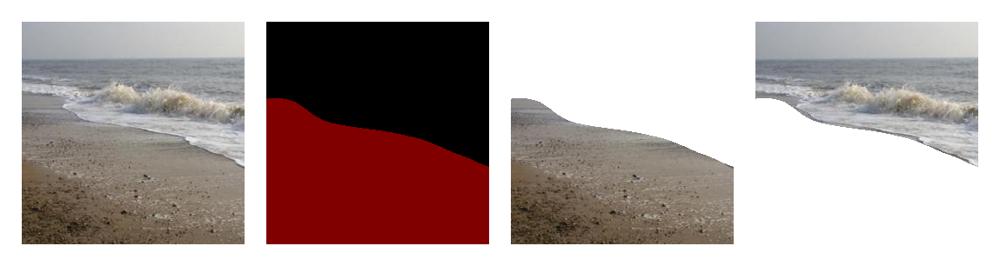
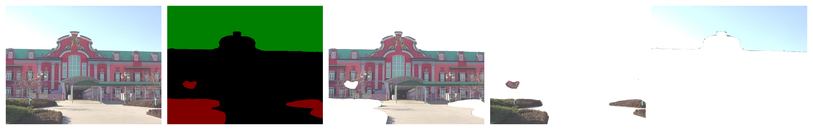

# Language-driven Semantic Segmentation利用mindspore框架复现

### 简介

语义分割是计算机视觉中的一个核心问题，其目的是将图像分割成具有各自语义类别标签的相关区域。大多数现有的语义分割方法都假定可以潜在地分配给像素一组有限的语义类标签。

康奈尔大学的Boyi Li等人提出了 LSeg，一种用于语言驱动的语义图像分割的新模型。

模型架构图如下：



通过上面这个模型架构图可以看到，整个 LSeg 模型分为三个主要部分：

1.图像编码网络

通过一个 CNN 或者 Transformer 模型，文章中测试了 ViT 和 CLIP 模型，用于编码图像特征

2.文本编码网络

通过一个 Transformer 模型，文章中测试了 CLIP 模型，用于编码文本特征

3.特征融合网络

使用一些 CNN 模块融合图像和文本特征，并生成图像分割结果

模型训练时与常规的图像语义分割模型类似，同样使用有标签的语义分割数据，做一个有监督训练。不同的是，训练时将图像的语义标签作为额外的输入，转换为特定维度的文本特征，控制分割输出的类别和类别数量。这样就可以使用多个不同的语义分割数据集进行融合训练，即使他们的标签不尽相同，也可以正常的训练模型。

## Start

大作业根据LSeg的开源代码，对其中的主要部分利用mindspore框架进行改写，分别为`lang-seg/modules/models/lseg_blocks.py`，`lang-seg/modules/models/lseg_net.py`,`lang-seg/modules/lseg_module.py`.

### 硬件环境与依赖库

相关的系统与硬件配置如下：

- Linux x86_64
- Ubuntu 18.04
- NVIDIA Tesla T4 (CUDA 11.4)

项目所需的主要依赖库如下：

- mindspore 1.7.0
- pytorch 1.7.1
- pytorch-lightning 1.3.5
- opencv-python
- PyTorch-Encoding
- CLIP

### 数据集

利用LSeg官方提供的数据集：ADEChallengeData2016

数据集下载：

```
python prepare_ade20k.py
unzip ../datasets/ADEChallengeData2016.zip
```

数据集文件结构如下，ADEChallengeData2016下的annotation和images分别存放标注文件和图片，且都被分成对应的training集和validation集：

```
.
└── ADEChallengeData2016
    ├── annotations
    │   ├── training
    │   └── validation
    └── images
        ├── training
        └── validation
```

### 训练

利用官方提供的训练脚本`train.sh`，训练参数信息采用官方设置好的参数。

```
bash train.sh
```

```bash
#!/bin/bash

python -u train_lseg.py --dataset ade20k --data_path ../datasets --batch_size 1 --exp_name lseg_ade20k_l16  --base_lr 0.004 --weight_decay 1e-4 --no-scaleinv --max_epochs 200 --widehead --accumulate_grad_batches 2 --backbone clip_vitl16_384
```

训练开始后会输出模型的基本信息等。

```
** Use norm [0.5, 0.5, 0.5], [0.5, 0.5, 0.5] as the mean and std **
{'base_size': 520, 'crop_size': 480}
train
BaseDataset: base_size 520, crop_size 480
../datasets
---------../datasets/ADEChallengeData2016
len(img_paths): 40420
val
../datasets
---------../datasets/ADEChallengeData2016
len(img_paths): 4000
label path is label_files/ade20k_objectInfo150.txt
```

### 测试

1.输入三张图片用于测试分割结果

输入一张猫的照片，同时给模型输入的分割依据为：猫、植物、草地、石头

```
args.label_src = 'plant,grass,cat,stone,other'
```

输入一张海边的照片，同时给模型输入的分割依据为：海、沙滩

```
args.label_src = 'sea,beach,other'
```

输入一张建筑的照片，同时给模型输入的分割依据为：建筑、天空、植被

```
args.label_src = 'building,plant,sky,other'
```

```python
python test_lseg.py --backbone clip_vitl16_384 --eval   --weights checkpoints/lseg_ade20k_l16.ckpt --widehead --no-scaleinv 
```

2.输出如下：

测试图片是猫的分割结果



测试图片是大海的分割结果。



测试图片是建筑的分割结果。



### 参考资料

1. Li, Boyi et al. “Language-driven Semantic Segmentation.” *ArXiv* abs/2201.03546 (2022): n. pag.
2. [mindspore](https://mindspore.cn/docs/zh-CN/r1.7/index.html)
3. https://github.com/isl-org/lang-seg
4. https://github.com/mindspore-ai/mindspore/tree/master